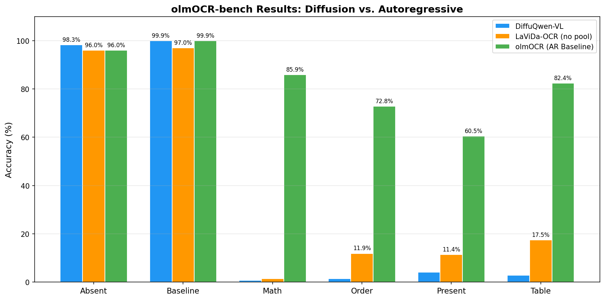

# Exploring Discrete Diffusion for Vision-Language Document Understanding

> **Seminar:** Selected Topics in Data Science  
> **Author:** Mahmoud Abdellahi  
> **Supervisor:** Tianyu Yang  
> **Semester:** Winter 2025/26

---

## Research Question

> *Can bidirectional generation via discrete diffusion provide a better or competitive paradigm for OCR compared to autoregressive models?*

Humans don't read text left-to-right one character at a time — we jump around, use surrounding context, and iteratively refine our understanding of difficult passages. Yet all state-of-the-art OCR models (olmOCR, DeepSeek-OCR) are **autoregressive**: they generate text one token at a time, left-to-right, with no ability to revise.

**Discrete diffusion** offers a fundamentally different paradigm that mirrors how humans read:

- **Bidirectional context** — fill in `"experim_ntal res_lts"` using *both* surrounding sides
- **Iterative refinement** — revisit low-confidence predictions using updated context
- **Parallel decoding** — unmask multiple tokens per step

This project tests whether these theoretical advantages translate to practical gains on OCR through two complementary experiments.

---

## Key Results



| Category | DiffuQwen-VL | LaViDa-OCR | olmOCR (AR Baseline) |
|----------|:------------:|:----------:|:--------------------:|
| **Absent** | **98.3%** | 96.0% | 96.0% |
| **Baseline** | **99.9%** | 97.0% | 99.9% |
| **Math** | 0.7% | 1.4% | **85.9%** |
| **Order** | 1.5% | 11.9% | **72.8%** |
| **Present** | 4.2% | 11.4% | **60.5%** |
| **Table** | 2.8% | 17.5% | **82.4%** |
| **Inference Time** | ~17 sec/page | ~145 sec/page | **~2–3 sec/page** |

**Answer: No** — autoregressive models remain superior for OCR. Diffusion matches AR on plain text but falls dramatically short on structured content (math, tables, reading order), where exact character-level reproduction and sequential structural constraints are essential.

---

## Two Experiments

### Experiment 1: LaViDa-OCR — Diffusion from Scratch

Fine-tune [LaViDa](https://arxiv.org/abs/2505.16839) (NeurIPS 2025 Spotlight), a purpose-built diffusion vision-language model, for OCR. LaViDa couples **LLaDA-8B** (a discrete diffusion LLM) with a **SigLIP-400M** vision encoder.

| Component | Details |
|-----------|---------|
| Vision Encoder | SigLIP-400M (frozen) |
| Projector | 2-layer MLP (GeLU) |
| Language Model | LLaDA-8B (discrete diffusion) |
| Training Data | ~280,000 docs (olmOCR training set) |
| Training Steps | ~11,000 |
| GPUs | 4× NVIDIA H100 |

**Critical discovery:** LaViDa's default **2×2 average pooling** destroys OCR capability. Removing it improved Baseline accuracy from 17.5% → 97.0% (+454%) but increased inference time from ~3s to ~145s per page.

→ *Details: [docs/LAVIDA.md](docs/LAVIDA.md)*

### Experiment 2: DiffuQwen-VL — AR→Diffusion Adaptation

Adapt a pretrained autoregressive VLM (**Qwen2.5-VL-7B** via olmOCR) into a discrete diffusion model using the [DiffuLLaMA](https://arxiv.org/abs/2410.17891) methodology. Instead of training diffusion from scratch, leverage the AR model's existing language knowledge.

| Component | Details |
|-----------|---------|
| Vision Encoder | Frozen Qwen2.5-VL ViT (dynamic resolution, M-RoPE) |
| LLM Backbone | Qwen2.5-7B with LoRA (r=32, α=32) |
| Trainable Parameters | ~20M (0.24% of 8.3B total) |
| Training Data | 267,962 documents (olmOCR training mix) |
| Training Steps | 20,000 (loss: 109.8 → 1.5) |
| GPUs | 4× NVIDIA H100 |

**Three pillars of adaptation from DiffuLLaMA:**
1. **Attention Mask Annealing** — gradual causal → bidirectional transition over 10,000 steps
2. **Shift Operation** — `labels[i] = input_ids[i+1]` to maintain AR compatibility
3. **Absorbing State + 1/t Reweighting** — linear masking schedule with precision emphasis

→ *Details: [docs/DIFFUQWEN.md](docs/DIFFUQWEN.md)*

---

## Why Diffusion Struggles with OCR

From the analysis of both experiments, four root causes emerge:

1. **Independent token sampling** — diffusion predicts each masked position independently per step. Math expressions like `\frac{d}{dx}` require exact sequential dependencies that diffusion cannot enforce.

2. **Stochastic unmasking** — which tokens get revealed at each step is random. AR models naturally produce structured output (e.g., `| col1 | col2 |`) through sequential generation, while diffusion may unmask table delimiters out of order.

3. **No structural enforcement** — LaTeX, markdown tables, and reading order require rigid syntactic constraints. Diffusion's strength in "exploring variations" becomes a liability when only one exact output is valid.

4. **Inference cost** — 64 full forward passes (no KV caching) vs. a single AR pass with KV cache, yielding 6–50× slower inference.

→ *Full analysis: [docs/RESULTS.md](docs/RESULTS.md)*  
→ *Theoretical background: [docs/METHODOLOGY.md](docs/METHODOLOGY.md)*

---

## Model Checkpoints

| Model | Checkpoint | Size | Download |
|-------|-----------|------|----------|
| **DiffuQwen-VL** | `checkpoint-20000` (LoRA adapter) | ~77 MB | [Download Link (TBD)](#) |
| **LaViDa-OCR** | `checkpoint-10750` (full model, no pooling) | ~15 GB | [Download Link (TBD)](#) |

**DiffuQwen-VL** requires the base model [olmOCR](https://huggingface.co/allenai/olmOCR-7B-0225-preview) (Qwen2.5-VL-7B fine-tuned by Allen AI).  
**LaViDa-OCR** requires the [LaViDa](https://github.com/jdchang1/LaViDa) framework and [SigLIP-SO400M](https://huggingface.co/google/siglip-so400m-patch14-384) vision encoder.

---

## Project Structure

```
Discrete-OCR-Diffusion-Models/
├── README.md
├── DiffuQwen/                         # Experiment 2: AR→Diffusion Adaptation
│   ├── diffu/                         # Core diffusion modules
│   │   ├── schedule.py                # Absorbing state noise schedule
│   │   ├── attention.py               # Attention mask annealing (causal→bidirectional)
│   │   ├── loss.py                    # Masked cross-entropy with shift + 1/t reweighting
│   │   └── sampler.py                 # Iterative denoising sampler (Algorithm 2)
│   ├── qwen/                          # Qwen2.5-VL integration
│   │   ├── data.py                    # olmOCR dataset loader
│   │   ├── collator.py                # Batch collation for training
│   │   └── attention_patch.py         # Runtime attention mask injection
│   ├── configs/                       # Training configurations
│   │   ├── train_config.yaml          # Hyperparameters
│   │   ├── lora_config.yaml           # LoRA variants (r=8/16/32)
│   │   └── ds_config.json             # DeepSpeed ZeRO-2 config
│   ├── scripts/
│   │   ├── train.sh                   # Multi-GPU training launcher
│   │   └── train_distributed.sh       # Distributed training with resume
│   ├── train.py                       # HuggingFace Trainer with diffusion loss
│   ├── infer.py                       # Single-image/batch inference
│   ├── eval.py                        # CER/WER evaluation metrics
│   ├── run_benchmark.py               # olmOCR-bench evaluation
│   └── requirements.txt
├── LaViDa-OCR/                        # Experiment 1: Diffusion from Scratch
│   ├── lavida/                        # Full LaViDa framework (forked)
│   │   ├── llava/                     # Core vision-language model library
│   │   │   ├── model/                 # Model definitions
│   │   │   │   ├── language_model/    # LLaDA, DREAM, LLaMA backends
│   │   │   │   ├── multimodal_encoder/# SigLIP, EVA-CLIP, MLCD encoders
│   │   │   │   ├── multimodal_projector/ # MLP projector
│   │   │   │   └── multimodal_resampler/ # Pooling, perceiver, etc.
│   │   │   ├── train/                 # Training pipeline
│   │   │   │   ├── train.py           # Main training script (DeepSpeed)
│   │   │   │   └── llava_trainer.py   # Custom HF Trainer for LaViDa
│   │   │   ├── conversation.py        # Chat templates (llada, dream, etc.)
│   │   │   ├── mm_utils.py            # Multimodal utilities
│   │   │   └── constants.py           # Token constants
│   │   ├── scripts/                   # DeepSpeed configs + training recipes
│   │   │   └── train/exps/cluster/    # SLURM training scripts
│   │   ├── predict_ocr.py             # Single-GPU batch OCR (original)
│   │   ├── predict_ocr_si.py          # Single-image inference (original)
│   │   └── pyproject.toml             # Package definition
│   ├── data_preparation/              # olmOCR → LaViDa format conversion
│   │   ├── convert_olmocr_parallel.py # Parallel PDF→PNG + JSON conversion
│   │   ├── convertolmocr_bench.py     # Benchmark data preparation
│   │   ├── edit_lavida_json_data.py   # JSON cleanup (YAML stripping, prompt fixing)
│   │   ├── check_corrubted_images.py  # Image validation
│   │   └── extract_all_olmocr.sh      # Download olmOCR-mix-1025 from HuggingFace
│   ├── inference/
│   │   ├── predict_ocr.py             # Single-GPU batch benchmark (argparse)
│   │   ├── predict_ocr_si.py          # Single-image LaViDa inference
│   │   ├── predict_parallel.py        # Multi-GPU parallel inference worker
│   │   ├── run_parallel.sh            # 4-GPU parallel launcher
│   │   └── olmocr_infer.py            # olmOCR AR baseline inference
│   └── training/
│       ├── finetune_olmocr.sh         # Fine-tuning launcher
│       ├── stage2.yaml                # Multi-dataset training composition
│       └── zero3.json                 # DeepSpeed ZeRO-3 config
├── assets/                            # Generated visualizations
│   ├── benchmark_comparison.png       # 3-way bar chart (DiffuQwen vs LaViDa vs olmOCR)
│   ├── diffuqwen_training_loss.png    # Training + evaluation loss curves
│   ├── diffuqwen_training_loss_zoomed.png
│   ├── lavida_jsonl_breakdown.png     # Per-JSONL category results
│   └── lavida_pooling_comparison.png  # Pooling vs no-pooling results
└── docs/
    ├── DIFFUQWEN.md                   # DiffuQwen-VL technical details
    ├── LAVIDA.md                      # LaViDa-OCR technical details
    ├── RESULTS.md                     # Comprehensive results & analysis
    └── METHODOLOGY.md                 # Discrete diffusion theory
```

---

## Quick Start

### DiffuQwen-VL Inference

```bash
# Install dependencies
pip install -r DiffuQwen/requirements.txt

# Single image inference (requires olmOCR base model + LoRA checkpoint)
python DiffuQwen/infer.py \
    --image document.png \
    --checkpoint /path/to/checkpoint-20000 \
    --num_steps 64 --temperature 0.5

# Run olmOCR-bench benchmark
python DiffuQwen/run_benchmark.py \
    --checkpoint /path/to/checkpoint-20000 \
    --bench_dir /path/to/olmOCR-bench/bench_data/pdfs \
    --num_gpus 4
```

### DiffuQwen-VL Training

```bash
# Edit paths in scripts/train.sh, then:
bash DiffuQwen/scripts/train.sh
```

### LaViDa-OCR Inference

```bash
# Requires LaViDa framework (https://github.com/jdchang1/LaViDa)
# Edit checkpoint/vision paths in inference scripts, then:
python LaViDa-OCR/inference/predict_ocr_si.py

# Parallel benchmark inference (4 GPUs)
bash LaViDa-OCR/inference/run_parallel.sh
```

### LaViDa-OCR Data Preparation & Training

```bash
# 1. Extract olmOCR training data from HuggingFace
bash LaViDa-OCR/data_preparation/extract_all_olmocr.sh

# 2. Convert PDFs to images + LaViDa JSON format
python LaViDa-OCR/data_preparation/convert_olmocr_parallel.py

# 3. Clean and prepare final training JSON
python LaViDa-OCR/data_preparation/edit_lavida_json_data.py

# 4. Fine-tune (edit paths in finetune_olmocr.sh first)
bash LaViDa-OCR/training/finetune_olmocr.sh
```

---

## Evaluation: olmOCR-bench

Both models are evaluated on the [olmOCR benchmark](https://github.com/allenai/olmocr), which scores OCR output across 6 categories:

| Category | What it Tests | # Documents |
|----------|---------------|:-----------:|
| **Absent** | Correctly outputting nothing for blank pages | — |
| **Baseline** | Standard text recognition on clear documents | — |
| **Math** | LaTeX equation recognition (arxiv papers) | 522 |
| **Order** | Reading order for multi-column layouts | — |
| **Present** | Mixed text/image content discrimination | — |
| **Table** | Markdown table structure preservation | 188 |

The benchmark also includes `long_tiny_text` and sub-categories (headers_footers, multi_column, old_scans, old_scans_math).

---

## References

1. **DiffuLLaMA:** Gong et al., "Scaling Diffusion Language Models via Adaptation from Autoregressive Models," arXiv:2410.17891, 2024.
2. **LaViDa:** "LaViDa: A Large Diffusion Language-Vision Model for Multimodal Understanding," NeurIPS 2025 Spotlight, arXiv:2505.16839.
3. **LLaDA:** Nie et al., "Large Language Diffusion Models," arXiv:2502.09992, 2025.
4. **olmOCR:** Allen AI, "olmOCR: Toolkit for Linearizing PDFs for LLM Datasets/Evaluation," 2024.
5. **Qwen2.5-VL:** Alibaba, "Qwen2.5-VL: Enhancing Vision-Language Model's Perception of the World at Any Resolution," 2025.

---

## Citation

```bibtex
@misc{abdellahi2026discrete-ocr-diffusion,
  author       = {Mahmoud Abdellahi},
  title        = {Exploring Discrete Diffusion for Vision-Language Document Understanding},
  year         = {2026},
  institution  = {Georg-August-Universität Göttingen},
  note         = {Selected Topics in Data Science, Winter 2025/26}
}
```

## License

This project is for academic and research purposes. The underlying models (Qwen2.5-VL, LLaDA, LaViDa, olmOCR) are subject to their respective licenses.
