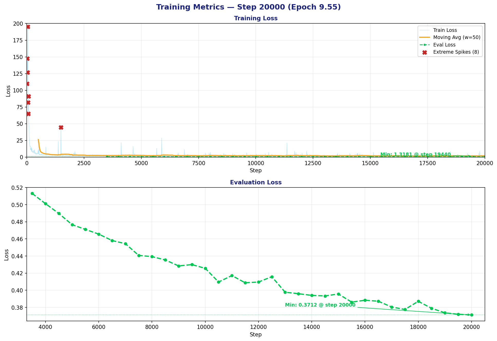
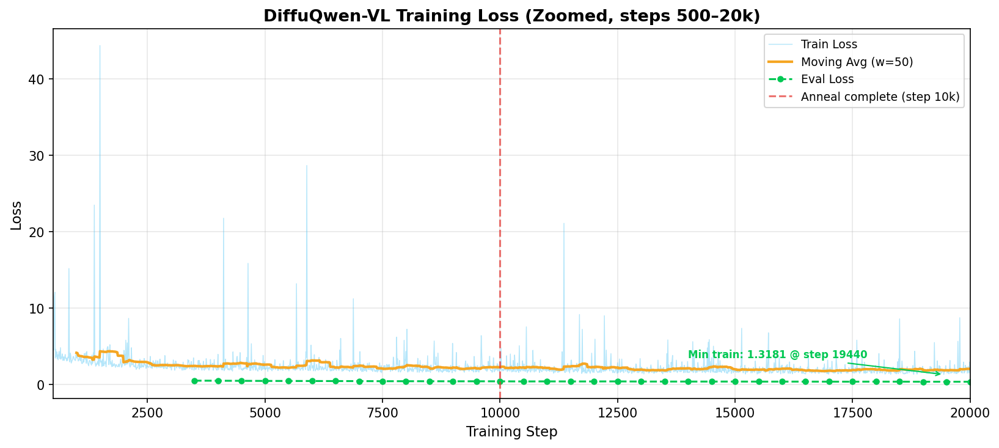

# DiffuQwen-VL: Adapting an Autoregressive VLM to Discrete Diffusion for OCR

## Overview

DiffuQwen-VL adapts the pretrained **Qwen2.5-VL-7B** (via [olmOCR](https://huggingface.co/allenai/olmOCR-7B-0225-preview)) from autoregressive to discrete diffusion decoding, following the [DiffuLLaMA](https://arxiv.org/abs/2410.17891) methodology. Rather than training a diffusion model from scratch (as in the LaViDa experiment), we leverage the AR model's existing OCR knowledge and adapt it for bidirectional generation with LoRA fine-tuning.

**Result:** DiffuQwen-VL achieves **99.9% Baseline** and **98.3% Absent** accuracy on olmOCR-bench — matching the AR baseline on plain text — but struggles with structured content (Math: 0.7%, Tables: 2.8%).

---

## Architecture

### Base Model

- **Qwen2.5-VL-7B**, already fine-tuned for document OCR by Allen AI as olmOCR
- **Vision Encoder:** Qwen2.5-VL ViT with dynamic resolution and M-RoPE (frozen during training)
- **Language Model:** Qwen2.5-7B decoder with LoRA adaptation

### LoRA Configuration (Verified from checkpoint)

| Parameter | Value |
|-----------|-------|
| LoRA Rank (r) | 32 |
| LoRA Alpha (α) | 32 |
| Target Modules | `q_proj`, `k_proj`, `v_proj`, `o_proj` |
| LoRA Dropout | 0.05 |
| Trainable Params | 20,185,088 (~0.24% of 8.3B total) |
| Vision Encoder | Frozen |
| PEFT Version | 0.18.0 |

---

## Three Pillars of AR→Diffusion Adaptation

These three techniques from DiffuLLaMA enable converting a pretrained AR model into a diffusion model without catastrophic collapse.

### 1. Attention Mask Annealing

AR models are trained with **causal** (lower-triangular) attention. Switching to bidirectional immediately causes collapse because the model has never learned to use right-side context.

**Solution:** Linearly increase visible right-side context over 10,000 training steps:

```
Step 0 (Causal):        Step 5000 (Partial):    Step 10000+ (Bidirectional):
1 0 0 0 0               1 1 1 0 0               1 1 1 1 1
1 1 0 0 0               1 1 1 1 0               1 1 1 1 1
1 1 1 0 0       →       1 1 1 1 1       →       1 1 1 1 1
1 1 1 1 0               1 1 1 1 1               1 1 1 1 1
1 1 1 1 1               1 1 1 1 1               1 1 1 1 1
```

### Multimodal Attention Rules

| Interaction | Mask | Rationale |
|-------------|------|-----------|
| Image ↔ Image | Full bidirectional | Visual features need global context |
| Image ↔ Text | Full bidirectional | Text must always see the complete image |
| Text ↔ Image | Full bidirectional | OCR requires access to all image regions |
| Text ↔ Text | **Annealed** | Gradual causal → bidirectional over 10k steps |

Only text↔text attention is annealed. All interactions involving image tokens use full bidirectional attention from the start.

### 2. Shift Operation

The AR model was trained for **next-token prediction**: position `i` predicts token `i+1`. Standard denoising would train position `i` to predict token `i` — which means at unmasked positions the model trivially sees its own answer.

**Solution:** Apply a label shift so `labels[i] = input_ids[i+1]`:

```
Without shift:  Position sees [MASK] → must predict "brown" (but position 2 sees "brown" → trivial)
With shift:     Position sees [MASK] → must predict NEXT token (exactly as AR model learned)
```

During inference, the shift is reversed: prepend a start token, run the model, shift predictions back.

### 3. Absorbing State + 1/t Loss Reweighting

**Noise schedule (absorbing state):** Each token is independently replaced by `[MASK]` with probability `t`:
- `t = 0`: clean data (no masks)
- `t = 1`: fully masked

**Loss function:** Cross-entropy computed only on masked positions, weighted by `1/t`:

$$\mathcal{L} = \frac{1}{t} \sum_{i \in \text{masked}} \text{CE}(f_\theta(x_t)_i,\; x_0^{i+1})$$

The `1/t` reweighting forces the model to be most precise when few tokens remain masked (low noise) — the critical regime for the final denoising steps.

---

## Training Details (Verified from Logs)

### Dataset
- **Source:** olmOCR training mix (allenai/olmOCR-mix-1025)
- **Documents:** 267,962 (scientific papers, books, historical documents, government archives)
- **Format:** PDF page images paired with markdown transcriptions

### Hyperparameters

| Parameter | Value |
|-----------|-------|
| Learning Rate | 1e-4 (cosine schedule) |
| Warmup Steps | 1,000 |
| Training Steps | 20,000 (of 104,700 planned, ~50 epochs) |
| Batch Size | 4 per GPU × 4 GPUs |
| Gradient Accumulation | 32 (effective batch = 128) |
| Max Sequence Length | 8,192 (vision + text tokens) |
| Anneal Steps | 10,000 |
| Precision | BF16 |
| Gradient Clipping | 1.0 |
| Weight Decay | 0.01 |

### Training Convergence

From actual training logs (diffuqwen-hf-20260127-013517):





| Metric | Value |
|--------|-------|
| Initial loss (step 10) | 109.76 |
| Loss at step 10,000 | 2.51 |
| Final loss (step 20,000) | 1.50 |
| Anneal completion | Step 10,000 (progress = 1.0) |
| Training infrastructure | 4× NVIDIA A100 (80GB) |

---

## Inference

### Iterative Denoising (Algorithm 2 from DiffuLLaMA)

```
1. Initialize x_T = [MASK, MASK, ..., MASK]  (max_tokens positions)
2. For t in {T, T-1, ..., 1}  (T=64 steps by default):
   a. Prepend start token (for shift alignment)
   b. Forward pass with full bidirectional attention → logits
   c. Shift logits back: predictions[i] = logits[i-1]
   d. For each masked position:
      - Sample token from logits (temperature, top-p, top-k)
      - Compute unmask probability from posterior
      - Stochastically unmask or keep [MASK]
3. Trim at first EOS token
4. Return decoded markdown
```

### Generation Settings (Used for Benchmark)

| Parameter | Value |
|-----------|-------|
| Diffusion Steps | 64 |
| Temperature | 0.5 |
| Top-p | 0.95 |
| Top-k | 50 |
| CFG Weight | 1.5 |
| Max Tokens | 2,048 |

### Benchmark Processing (1,403 PDFs across 7 categories)

| Category | # PDFs | Avg Time/PDF |
|----------|:------:|:------------:|
| arxiv_math | 522 | 17.45 sec |
| headers_footers | 266 | 17.42 sec |
| multi_column | 231 | 17.43 sec |
| tables | 188 | 17.13 sec |
| old_scans | 98 | 17.90 sec |
| long_tiny_text | 62 | 17.19 sec |
| old_scans_math | 36 | 16.54 sec |

Processing time is remarkably consistent (~17 sec) across all categories because the fixed number of diffusion steps (64) dominates inference time regardless of content complexity.

---

## Module Reference

### `diffu/schedule.py`
Absorbing state noise schedule. Implements linear (`α_t = 1 - t`), cosine, and logit-normal schedules. Key methods: `sample_timesteps()`, `apply_absorbing_noise()`, `get_inference_timesteps()`.

### `diffu/attention.py`
Attention mask construction and annealing. Builds causal, full, and annealed masks for text-text interactions. Handles multimodal rules (image tokens always get full attention).

### `diffu/loss.py`
Diffusion training loss. Implements `shift_labels()` for AR-compatible targets, `compute_diffusion_loss()` with masked cross-entropy and optional 1/t reweighting.

### `diffu/sampler.py`
Inference denoising loop. Implements `sample()` (Algorithm 2 from DiffuLLaMA) with shift-back, posterior sampling, and confidence-based unmasking. Includes anti-repetition penalty.

### `qwen/data.py`
Dataset loader for olmOCR documents. Finds PDF/image + markdown pairs, renders PDFs at 1288px longest dimension, strips YAML front matter.

### `qwen/collator.py`
Batch collation. Applies absorbing noise, creates text-region masks, handles variable-length vision+text sequences.

### `qwen/attention_patch.py`
Runtime attention patching via context manager. Injects custom annealed masks into Qwen's attention layers without modifying model source code.

---

## Configuration Files

- **`configs/train_config.yaml`** — Main training hyperparameters (learning rate, batch size, diffusion settings)
- **`configs/lora_config.yaml`** — LoRA configurations with multiple variants (minimal r=8, default r=16, full r=32)
- **`configs/ds_config.json`** — DeepSpeed ZeRO-2 for gradient partitioning
