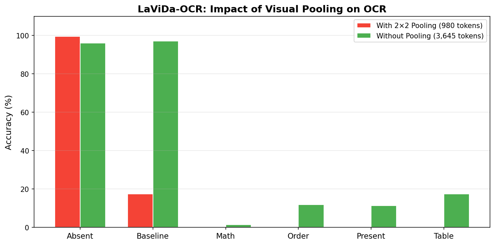
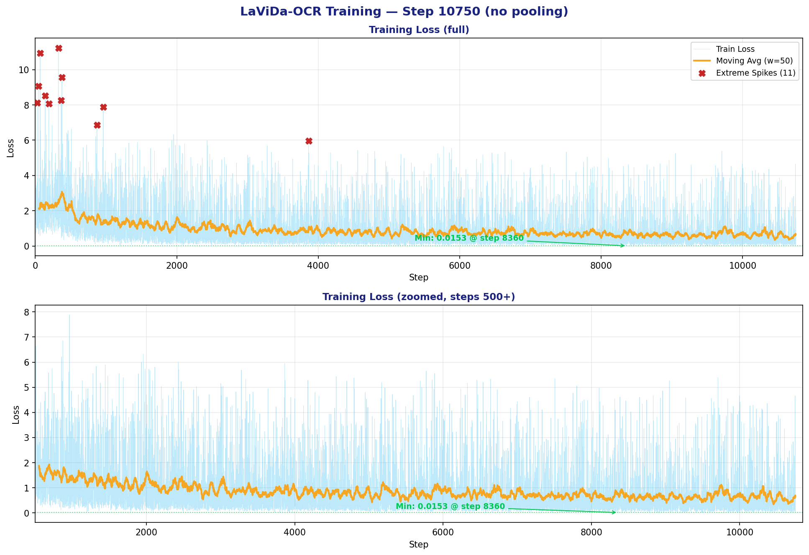

# LaViDa-OCR: Fine-Tuning a Diffusion Vision-Language Model for OCR

## Overview

[LaViDa](https://arxiv.org/abs/2505.16839) (NeurIPS 2025 Spotlight) is a large diffusion language-vision model that replaces autoregressive decoding with **discrete masked diffusion**. It couples a **LLaDA-8B** backbone (a discrete diffusion LLM) with a **SigLIP-400M** vision encoder through an MLP projector.

This experiment fine-tunes LaViDa on ~280,000 documents from the olmOCR training set for OCR, testing two visual resolution variants:
1. **With 2×2 average pooling** (original architecture) — 980 visual tokens
2. **Without pooling** (our modification) — 3,645 visual tokens

**Key finding:** Removing pooling transforms LaViDa from non-functional (17.5% Baseline) to competitive (97.0% Baseline) for OCR, but at 50× inference cost.

The full LaViDa framework source code is included in `LaViDa-OCR/lavida/` (forked from [jdchang1/LaViDa](https://github.com/jdchang1/LaViDa)), containing the model definitions, training pipeline, and DeepSpeed configurations.

---

## Architecture

| Component | Model | Parameters | Status |
|-----------|-------|:----------:|--------|
| **Vision Encoder** | SigLIP-400M (`google/siglip-so400m-patch14-384`) | 400M | Frozen |
| **Vision Projector** | 2-layer MLP (GeLU activation) | ~10M | Trainable |
| **Language Model** | LLaDA-8B (discrete diffusion) | 8B | LoRA fine-tuned |

### How LaViDa's Diffusion Works

LaViDa generates text through iterative denoising rather than left-to-right generation:

```
Step 0: [M] [M] [M] [M] [M] [M] [M] [M] [M] [M]     ← all masked
Step 1: [M] [M] [M] [M] quick [M] [M] [M] [M] [M]     ← highest confidence unmasked first
Step 2: The [M] [M] [M] quick brown [M] [M] [M] [M]
Step 3: The [M] [M] [M] quick brown fox [M] over [M]
  ...
Step K: The quick brown fox jumps over the lazy dog .   ← complete output
```

At each step, the model predicts tokens for all masked positions simultaneously, then stochastically unmasks high-confidence predictions while re-masking uncertain ones.

---

## Critical Discovery: Pooling Destroys OCR

### The Problem

LaViDa's original architecture uses **2×2 average pooling** on SigLIP output to reduce computational cost:

```
SigLIP output:  27×27 patches per view → 729 tokens per view
After 2×2 pool: 14×14 → 196 tokens per view
Total:          3,645 → 980 visual embeddings (73% spatial resolution lost)
```

### Why This Matters for OCR vs. General VQA

| Task | Resolution Needed | Pooling Impact |
|------|-------------------|----------------|
| **General VQA** ("What animal?") | Coarse features sufficient | Acceptable — semantic meaning preserved |
| **Document OCR** ("Read every character") | Fine details critical | **Catastrophic** — character strokes averaged away |

Characters like `l`, `I`, `1`, `|` differ by a few pixels. Pooling merges these distinctions, making text unreadable.

### Results: Pooling vs. No Pooling



| Category | With 2×2 Pooling | Without Pooling | Change |
|----------|:----------------:|:---------------:|:------:|
| **Absent** | 99.5% | 96.0% | −3.5% |
| **Baseline** | 17.5% | **97.0%** | **+454%** |
| **Math** | 0.0% | 1.4% | ↑ |
| **Order** | 0.0% | 11.9% | ↑ |
| **Present** | 0.0% | 11.4% | ↑ |
| **Table** | 0.0% | 17.5% | ↑ |
| **Inference Time** | ~2–3 sec | ~145 sec | 50× slower |

**With pooling**, the model could not read anything — it only detected text presence/absence (Absent: 99.5%). **Without pooling**, plain text accuracy jumped to 97%, but inference time increased to ~145 seconds per page due to 3.7× more visual tokens.

---

## Training Setup

### Dataset
- **Source:** olmOCR training set (allenai/olmOCR-mix-1025)
- **Documents:** ~280,000 (scientific papers, books, historical documents, government archives)
- **Format:** Converted to LaViDa's conversation JSON format using the data preparation pipeline

### Training Configuration

| Parameter | Value |
|-----------|-------|
| Base Model | LLaDA-8B-Instruct |
| Vision Encoder | SigLIP-400M (frozen) |
| Projector | MLP 2× GeLU |
| Training Steps | ~11,000 |
| Batch Size | 1 per GPU × 4 GPUs |
| Gradient Accumulation | 16 (effective batch = 64) |
| Learning Rate | 2e-5 (cosine decay, warmup ratio 0.03) |
| Trainable Modules | mm_vision_tower, mm_mlp_adapter, mm_language_model |
| Framework | DeepSpeed ZeRO-3 |
| GPUs | 4× NVIDIA H100 |

### Training Loss



The training loss drops from ~2.0 to ~0.8 over 10,750 steps, with early spikes subsiding after ~1,000 steps. The minimum recorded loss is **0.0153** at step 8,360. No evaluation loss is available (all data was used for training).

### Checkpoint

The best OCR checkpoint is `lavida-stage2-olmocr-opt-nopool/checkpoint-10750` (without pooling).

---

## Data Preparation Pipeline

Converting olmOCR data to LaViDa format requires several steps:

### Step 1: Extract olmOCR Data
```bash
# Download and extract from HuggingFace (4 subsets × 2 splits)
bash data_preparation/extract_all_olmocr.sh
```
Extracts `00_documents`, `01_books`, `02_loc_transcripts`, `03_national_archives` for both train and eval splits.

### Step 2: Convert PDFs to Images + JSON
```bash
# Parallel conversion (auto-detects workers from SLURM or CPU count)
python data_preparation/convert_olmocr_parallel.py
```
- Renders PDFs at 150 DPI using `pdftocairo` (fast, lossless)
- Creates LaViDa conversation-format JSON with image paths and markdown text
- Separates train/eval splits automatically

### Step 3: Clean and Finalize JSON
```bash
python data_preparation/edit_lavida_json_data.py
```
- Standardizes prompts across all entries
- Strips YAML front matter (`---...---`) from markdown text
- Produces `olmocr_train_final.json` for training

### Step 4: (Optional) Validate Images
```bash
python data_preparation/check_corrubted_images.py
```
- Verifies all images can be opened and decoded
- Produces cleaned JSON excluding corrupted entries

---

## Inference

### Single Image
```python
# predict_ocr_si.py (edit checkpoint and vision tower paths first)
python inference/predict_ocr_si.py
```

The inference script loads the LaViDa model with diffusion generation:
- **Warmup:** First generation with `step_ratio=1.0` (64 steps) 
- **Main:** Subsequent generations with `step_ratio=0.4` (~25 steps) for speed

### Single-GPU Batch (olmOCR-bench categories)
```bash
python inference/predict_ocr.py \
    --checkpoint  /path/to/lavida-checkpoint \
    --vision_tower /path/to/google-siglip-so400m-patch14-384 \
    --bench_images /path/to/olmOCR-bench/bench_data/images \
    --output_dir  /path/to/outputs
```
Iterates all 7 benchmark categories on one GPU, saving one `.md` file per image. Resume-safe (skips existing outputs).

### Parallel Benchmark (4 GPUs)
```bash
bash inference/run_parallel.sh
```
Distributes PDF files across GPUs. Each worker processes `chunk_size = total_PDFs / NUM_GPUS` files independently with CUDA device isolation.

### Key Generation Parameters

| Parameter | Value | Notes |
|-----------|-------|-------|
| Temperature | 0.2 | Lower than DiffuQwen (more deterministic) |
| Step Ratio | 0.4 | ~25 denoising steps |
| Block Length | 64 | Tokens per diffusion block |
| Prefix LM | True | Condition on prompt prefix |

---

## Comparison with DiffuQwen-VL

| Aspect | LaViDa-OCR | DiffuQwen-VL |
|--------|:----------:|:------------:|
| **Approach** | Diffusion model from scratch | Adapted pretrained AR model |
| **Base LLM** | LLaDA-8B (native diffusion) | Qwen2.5-7B (originally AR) |
| **Vision** | SigLIP-400M + MLP | Qwen2.5-VL ViT (M-RoPE) |
| **Training Steps** | ~11,000 | 20,000 |
| **Baseline Score** | 97.0% | **99.9%** |
| **Best Structured** | Table: 17.5% | Table: 2.8% |
| **Inference Speed** | ~145 sec | **~17 sec** |
| **Key Advantage** | Better on some structured tasks | Much faster, better plain text |

The adapted approach (DiffuQwen-VL) achieves better overall results with 8× faster inference, suggesting that leveraging pretrained AR knowledge is more effective than training diffusion from scratch for OCR.
