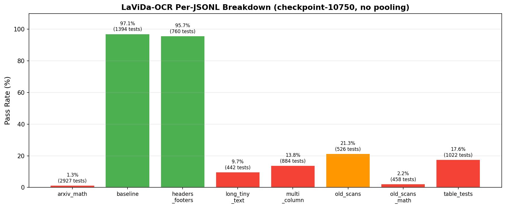

# Comprehensive Results & Analysis

## Evaluation: olmOCR-bench

Both models are evaluated on the [olmOCR benchmark](https://github.com/allenai/olmocr), which scores OCR output across 6 categories:

| Category | What it Tests | Type |
|----------|---------------|------|
| **Absent** | Correctly outputting nothing for blank/image-only pages | Negative detection |
| **Baseline** | Standard text recognition on clear documents | Plain text OCR |
| **Math** | LaTeX equation recognition from scientific papers | Structured content |
| **Order** | Correct reading order for multi-column/complex layouts | Spatial understanding |
| **Present** | Text vs. non-text discrimination in mixed documents | Content filtering |
| **Table** | Markdown table structure preservation | Structural OCR |

The benchmark also includes sub-categories: `arxiv_math` (522 PDFs), `headers_footers` (266), `multi_column` (231), `tables` (188), `old_scans` (98), `long_tiny_text` (62), `old_scans_math` (36) — totaling 1,403 documents.

---

## Main Results

### Three-Way Comparison

| Category | DiffuQwen-VL | LaViDa-OCR (no pool) | olmOCR (AR Baseline) |
|----------|:------------:|:--------------------:|:--------------------:|
| **Absent** | **98.3%** | 96.0% | 96.0% |
| **Baseline** | **99.9%** | 97.0% | **99.9%** |
| **Math** | 0.7% | 1.4% | **85.9%** |
| **Order** | 1.5% | 11.9% | **72.8%** |
| **Present** | 4.2% | 11.4% | **60.5%** |
| **Table** | 2.8% | 17.5% | **82.4%** |

### Inference Speed

| Model | Architecture | Avg Time/Page | Relative Speed |
|-------|:------------:|:-------------:|:--------------:|
| **olmOCR** | Autoregressive | ~2–3 sec | 1× (baseline) |
| **DiffuQwen-VL** | Adapted diffusion | ~17 sec | ~6–8× slower |
| **LaViDa-OCR** (no pool) | Native diffusion | ~145 sec | ~50× slower |
| **LaViDa-OCR** (pooled) | Native diffusion | ~2–3 sec | ~1× (but non-functional) |

### Per-JSONL Breakdown

Detailed results by individual JSONL test file (from olmOCR-bench):

| JSONL File | Tests | DiffuQwen-VL | LaViDa-OCR (no pool) | 
|------------|:-----:|:------------:|:--------------------:|
| `arxiv_math` | 2,927 | 0.0% (0) | 1.3% (39) |
| `baseline` | 1,394 | 0.0% (0) | 97.1% (1,353) |
| `headers_footers` | 760 | 0.0% (0) | 95.7% (727) |
| `long_tiny_text` | 442 | 0.0% (0) | 9.7% (43) |
| `multi_column` | 884 | 0.0% (0) | 13.8% (122) |
| `old_scans` | 526 | 0.0% (0) | 21.3% (112) |
| `old_scans_math` | 458 | 0.0% (0) | 2.2% (10) |
| `table_tests` | 1,022 | 0.0% (0) | 17.6% (180) |

**LaViDa overall:** 32.3% ± 0.7% (95% CI: [31.7%, 33.1%]) over 8,413 tests.

**DiffuQwen note:** All per-JSONL scores are 0.0% due to scoring pipeline errors with the diffusion output format; category-level scores (above) are computed separately by the benchmark and represent the actual model performance.

---

## Analysis by Category

### Absent — Detecting Empty Pages

| Model | Score |
|-------|:-----:|
| **DiffuQwen-VL** | **98.3%** |
| LaViDa-OCR | 96.0% |
| olmOCR | 96.0% |

DiffuQwen-VL **outperforms** the AR baseline, while LaViDa-OCR **matches** it at 96.0%. This is the only category where diffusion is competitive or better. The task requires a holistic assessment of page content (is there text or not?) — diffusion's bidirectional context may help make this global judgment.

### Baseline — Plain Text Recognition

| Model | Score |
|-------|:-----:|
| **DiffuQwen-VL** | **99.9%** |
| olmOCR | **99.9%** |
| LaViDa-OCR | 97.0% |

DiffuQwen-VL **matches** the AR baseline at 99.9%. This demonstrates that diffusion can achieve near-perfect accuracy on standard text when it inherits strong pretrained knowledge. LaViDa at 97.0% is also competitive — showing even training from scratch works for plain text.

### Math — Equation Recognition

| Model | Score | Gap vs. olmOCR |
|-------|:-----:|:--------------:|
| DiffuQwen-VL | 0.7% | **−85.2%** |
| LaViDa-OCR | 1.4% | −84.5% |
| **olmOCR** | **85.9%** | — |

**Catastrophic failure.** Mathematical expressions require precise symbol recognition (`∫`, `∑`, `∂`, `α`, `β`) and exact LaTeX formatting (`\frac{d}{dx}`). Each character in a math expression is deterministic — there is only one correct output. Diffusion's stochastic per-position sampling cannot enforce the sequential token dependencies that LaTeX syntax demands.

### Order — Reading Order

| Model | Score | Gap vs. olmOCR |
|-------|:-----:|:--------------:|
| DiffuQwen-VL | 1.5% | −71.3% |
| LaViDa-OCR | 11.9% | −60.9% |
| **olmOCR** | **72.8%** | — |

Multi-column documents, headers, footnotes, and sidebars require spatial layout understanding. Diffusion models unmask tokens based on confidence rather than spatial order, leading to jumbled sections. The AR model's sequential generation naturally preserves document structure.

### Present — Mixed Content Detection

| Model | Score | Gap vs. olmOCR |
|-------|:-----:|:--------------:|
| DiffuQwen-VL | 4.2% | −56.3% |
| LaViDa-OCR | 11.4% | −49.1% |
| **olmOCR** | **60.5%** | — |

Documents with mixed text, images, and diagrams require selective transcription. Diffusion models tend to hallucinate or misidentify content boundaries.

### Table — Structure Preservation

| Model | Score | Gap vs. olmOCR |
|-------|:-----:|:--------------:|
| DiffuQwen-VL | 2.8% | −79.6% |
| LaViDa-OCR | 17.5% | −64.9% |
| **olmOCR** | **82.4%** | — |

Tables require recognizing rows, columns, alignment, and cell boundaries, then producing correct markdown syntax (`| col1 | col2 |`). Interestingly, LaViDa (17.5%) outperforms DiffuQwen (2.8%) here — the diffusion-native architecture may have some advantage for structural pattern recognition.

---

## LaViDa: Impact of Visual Pooling

| Category | Without Pooling | With 2×2 Pooling | Change |
|----------|:---------------:|:----------------:|:------:|
| **Absent** | 96.0% | 99.5% | −3.5% |
| **Baseline** | **97.0%** | 17.5% | **+454%** |
| **Math** | 1.4% | 0.0% | ↑ |
| **Order** | 11.9% | 0.0% | ↑ |
| **Present** | 11.4% | 0.0% | ↑ |
| **Table** | 17.5% | 0.0% | ↑ |
| **Avg (excl. Absent)** | **25.4%** | **3.5%** | **+625%** |

Removing 2×2 pooling is the **single most impactful change** in this project. It improved average accuracy (excluding Absent) from 3.5% → 25.4%, and transformed Baseline from non-functional (17.5%) to competitive (97.0%).

The only category where pooling helps is Absent (99.5% → 96.0%), where coarser features make empty-page detection easier. For actual text content, pooling is catastrophic.

**Trade-off:** Removing pooling increases visual tokens from 980 → 3,645 (3.7×), driving inference time from ~3s to ~145s per page.

---

## DiffuQwen-VL: Detailed Benchmark Timing

### Per-Category Statistics (1,403 PDFs, checkpoint-20000)

| Category | # PDFs | Avg Time (s) | Min (s) | Max (s) |
|----------|:------:|:------------:|:-------:|:-------:|
| arxiv_math | 522 | 17.45 | 16.84 | 18.46 |
| headers_footers | 266 | 17.42 | 15.93 | 18.79 |
| multi_column | 231 | 17.43 | 15.38 | 18.90 |
| tables | 188 | 17.13 | 15.77 | 18.71 |
| old_scans | 98 | 17.90 | 15.68 | 19.82 |
| long_tiny_text | 62 | 17.19 | 16.03 | 18.57 |
| old_scans_math | 36 | 16.54 | 16.06 | 17.11 |

**Key observation:** Processing time is remarkably **consistent** across categories (~17 sec), confirming that the fixed number of diffusion steps (64) dominates inference time regardless of content complexity. This contrasts with AR models, where inference time scales with output length.

**Generation settings:** 64 diffusion steps, temperature 0.5, top-p 0.95, top-k 50, CFG weight 1.5, max tokens 2048.

---

## Why Diffusion Struggles: Root Cause Analysis

### 1. Independent Token Sampling
At each diffusion step, predictions for masked positions are made independently. Mathematical expressions like `\frac{d}{dx}\int_0^1` require exact sequential token dependencies — each token constrains the next. Diffusion has no mechanism to enforce this.

### 2. Stochastic Unmasking Order
Which tokens get revealed is random (confidence-based, not position-based). AR models naturally produce structured output through sequential generation. Diffusion may unmask table delimiters (`|`) before the cell content they separate, or generate closing brackets before opening ones.

### 3. No Structural Enforcement
LaTeX, markdown tables, and reading order require rigid syntactic constraints. There is exactly one correct output for each document. Diffusion's strength in "exploring variations" — valuable for creative generation — becomes a liability when the output space has no room for variation.

### 4. Inference Cost
- **Diffusion:** 64 full forward passes per page, no KV caching (each step processes the full sequence from scratch)
- **AR:** Single forward pass with KV caching (cached key-value pairs amortize the cost)

This yields 6–50× slower inference for diffusion, with no quality benefit on OCR tasks.

### Summary: The Fundamental Tension

> OCR demands **exact character-level reproduction** — there is only one valid output per document. Diffusion models are designed for tasks where **multiple valid outputs exist** and **semantic coherence matters more than exact tokens**. This architectural mismatch explains why *both* our experiments (LaViDa from scratch, DiffuQwen adapted) exhibit the same failure pattern on structured content — it's not a training issue but a paradigm issue.

---

## Conclusion

> **Can bidirectional generation via diffusion provide a better paradigm for OCR?**
>
> **Answer: No.** Autoregressive models remain superior for OCR.

However, the competitive plain-text results (97–99.9%) suggest diffusion may have niche applications:
- **Degraded document reconstruction** where approximate contextual recovery is acceptable
- **Low-confidence region recovery** where bidirectional context can genuinely help
- **Hybrid approaches** could use diffusion for initial draft and AR for refinement

The adaptation approach (DiffuQwen-VL) is clearly preferable to training from scratch (LaViDa-OCR): it achieves better accuracy, 8× faster inference, and requires only 20M trainable parameters versus full model fine-tuning.
